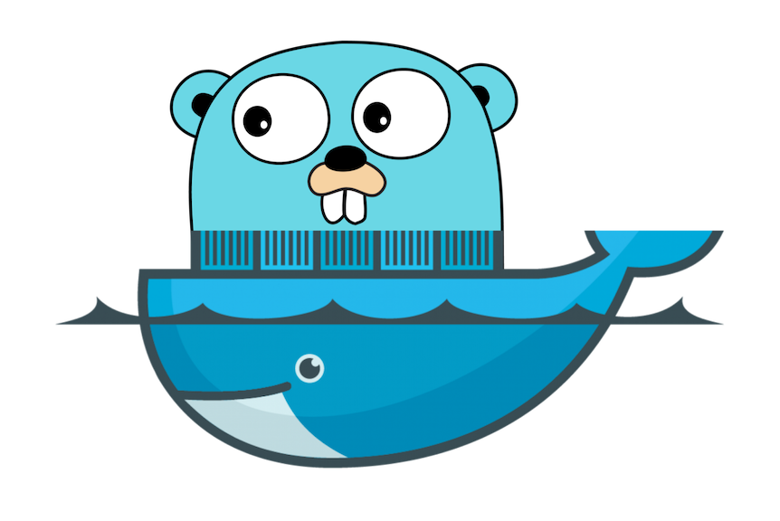

# go-slalom

go-slalom is a tiny web application made with [Go](https://golang.org) that showcases how to easily develop and deploy 
Go services in [Kubernetes](https://kubernetes.io).

These guides will help you 

- Setup [Docker Desktop](https://www.docker.com/products/docker-desktop) with [Kubernetes](https://kubernetes.io)
- Setup [Homebrew](https://brew.sh) and install [go](https://golang.org) 
- ~~Install go-slalom cli and create your own demo-app github repository~~
- Use [corba](https://github.com/spf13/cobra) to create a CLI for your service
- Use [skaffold](https://skaffold.dev) to build and deploy your service
- Use [goreleaser](https://goreleaser.com) to release your cli/service

### Guides

* [Pre-requisite Instructions](docs/prereqs.md)
* [Why Go](docs/why-go.md)
* [Why Kubernetes](docs/why-kubernetes.md)
* [Hello World in Go](docs/go-hello-world.md)
* [Deploy go-slalom](docs/deploy-go-slalom.md)

