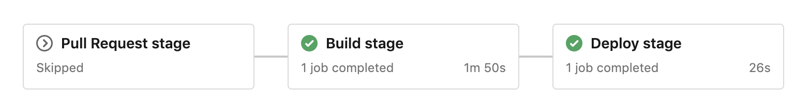

# Deploy go-slalom with Azure DevOps

The azure-pipelines.yml in this repository defines an Azure DevOps build and deploy pipeline. It has the following stages:

- Pull Request
  - runs unit-tests to verify pull-requests
- Build
  - tag git repository and create pre-release
  - builds and pushes image to goslalom.azurecr.io
  - push pipeline artifacts for deployment
- Deploy Dev
  - download artifacts
  - creates an image pull secret in kubernetes dev environment
  - uses aritifacts to create a service and deployment in kubernetes dev environment

