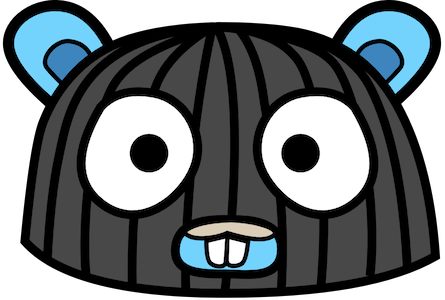

# Run go-slalom

go-slalom demonstrates how to create a basic service to run in kubernetes. The service includes the following:

- handles interrupts expected from kubernetes
- basic liveness and readiness end-points
- endpoints for enabling/disabling readiness and liveness endpoints
- endpoint for basic service information

### build go-slalom

First lets clone and build go-slalom locally

```bash
# tell go to use modules (still opt-in feature)
export GO111MODULE=on

# create a directory to checkout to
mkdir /tmp/slalom
cd /tmp/slalom
 
# clone go-slalom and cd to it
git clone git@github.com:tredfield/go-slalom.git
cd go-slalom

# build
go build
```

### go-slalom cli

go-slalom includes a basic cli built using [cobra](https://github.com/spf13/cobra). It is common in go to build a cli
for starting a service and/or administering the service. Lets check it out

```bash
# run to see cli help message
./go-slalom help
```

Notice that go-slalom `main` just calls `cmd.Execute()`

```go
func main() {
  cmd.Execute()
}
```

The package `cmd` contains the commands. The file `root.go` implements the root command and the other files implement 
sub commands. corba provides a clean cli.


### start go-slalom
One of the cli commands is `start`. Run it to start ther server

```bash
./go-slalom start
```

You should see logging similar to below. 
```bash
{"level":"info","msg":"Starting server...","service":"api","time":"2019-05-09T13:22:03-07:00"}
```

In a separate console run `curl localhost:8008/version`. You should see similar output 
```bash
{
  "commit": "unknown",
  "version": "0.0.1"
}
```

