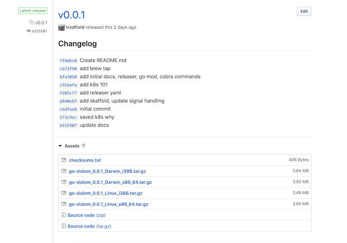
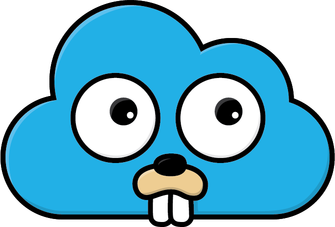

# Release go-slalom

If you are working on a cli or application that you want to make available to your team or otherwise then you will want
to create a github release and provide binaries.

Or you may want to create a release for your service with binaries and use those when creating an image.

Below will show you how to use [goreleaser](https://goreleaser.com) to release a go application. What does goreleaser do?

> GoReleaser builds Go binaries for several platforms, creates a GitHub release and then pushes a Homebrew formula to a
> tap repository. All that wrapped in your favorite CI.

## Use goreleaser

First install goreleaser

```bash
brew install goreleaser
```

goreleaser needs a github token to access your repository

```bash
export GITHUB_TOKEN=`YOUR_TOKEN`
```

It uses the latest tag applied to your repository. Create a tag if one does not exist

**Note**, the tag must adhere to [semantic versioning](https://goreleaser.com/semver).

```bash
$ git tag -a v0.1.0 -m "First release"
$ git push origin v0.1.0
```

You will also need to create a git repository for homebrew tap

- Create git repository with name `homebrew-tap` at <https://github.com/new>
- if you want to use a different name change the name at `brew.github.name` in [.goreleaser.yml](../.goreleaser.yml)
- change the `brew.github.owner` value in [.goreleaser.yml](../.goreleaser.yml) to your github handle.

Now run goreleaser!

```bash
goreleaser
```

It will create a release in your repository with a changelog (containing commits for the release) and attached binaries



You can use Homebrew to install it

```bash
brew tap $USER/homebrew-tap
brew install go-slalom
```

You should see similar output

```bash
==> Installing tredfield/tap/go-slalom
==> Downloading https://github.com/tredfield/go-slalom/releases/download/v0.0.1/go-slalom_0.0.1_Darwin_x86_64.tar.gz
==> Downloading from https://github-production-release-asset-2e65be.s3.amazonaws.com/184909404/22f48880-71d3-11e9-951b-d
######################################################################## 100.0%
/usr/local/Cellar/go-slalom/0.0.1: 4 files, 10MB, built in 6 seconds
```

## Next

[What's Next?](whats-next.md)


