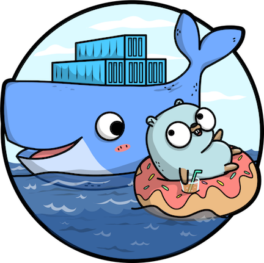

# 1 minute Kubernetes 101

Below is the very basics you need for kubernetes. See <https://kubernetes.io/docs/tutorials/> for more info

## pods, deployments, and services

Pods, deployments, and services are the basics you need to know when deploying to kubernetes. They are what define your containerized application and how it is ran in kubernetes. They are configured in yaml or json. Here is an example of a Deployment definition:

```yaml
apiVersion: apps/v1
kind: Deployment
metadata:
  name: go-slalom
  labels:
    app: go-slalom
spec:
  replicas: 1
  selector:
    matchLabels:
     app: go-slalom
  template:
    metadata:
      labels:
        app: go-slalom
    spec:
      containers:
      - name: go-slalom
        image: go-slalom
        command:
          - go-slalom
          - start
        ports:
        - name: http
          containerPort: 8080
          protocol: TCP

```

- **pod**: A pod is a group of 1 or more containers. Usually it's a single container and configures the image used to run that container. You can directly deploy pod definition to kubernetes, but usually you will define a deployment.

- **deployments**: Group identical pods and define their lifecycle and scaling. Killing, restarting, update strategies, etc

- **service**: A service is a selection of like pods. It abstracts how the pods, and thus your application, are accessed (either in the cluster or from outside). While pods may live and die, the service persists until you destroy it.


## configmaps

Configmaps are used to store non-confidential data in key-value pairs. Pods can consume ConfigMaps as environment variables, command-line arguments, or as configuration files in a volume.

Configmaps often service as an "environment profile"

## secrets

Secrets are similar to configmaps but used for confidential data. Their values can be mapped to pods in the same way as configmaps. Kubernetes provides a friendly way for you to securely store and edit secrets and often used for user credentials, api keys, etc

## kubectl

kubectl is the cli you will frequently use to manage applications in kubernetes. However, you can also manage applications in a kubernetes dashboard.

## Next

[Why Go?](why-go.md)

