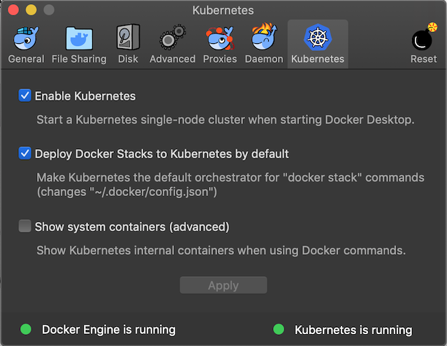

# Pre-requisites

Please make sure the following have been completed. These steps include the 
following setups:

- Docker Desktop
- Homebrew
- go
- (optional) Kubernetes Dashboard

## Install Docker Desktop

Docker Desktop includes Kubernetes. Use the appropriate link to download and install (links include installation instructions).

- macOS

<https://hub.docker.com/editions/community/docker-ce-desktop-mac>

- windows

**Note for Windows you will need to use the Windows Subsystem for Linux to run commands in the guides. If necessary please install WSL here:** <https://docs.microsoft.com/en-us/windows/wsl/install-win10>

<https://hub.docker.com/editions/community/docker-ce-desktop-windows>

Once Docker Desktop is installed, you need to explicitly enable Kubernetes support. Click the Docker icon in the status bar, go to “Preferences”, and on the “Kubernetes” tab check “Enable Kubernetes”

This will start kubernetes and install `kubectl`.  This might take a while, but the dialog will let you know once the Kubernetes cluster is ready.



## Install Homebrew

Homebrew is a package manager

- macOS

```bash
/usr/bin/ruby -e "$(curl -fsSL https://raw.githubusercontent.com/Homebrew/install/master/install)"
```

- Linux or Windows Subsystem for Linux (WSL)

```bash
sh -c "$(curl -fsSL https://raw.githubusercontent.com/Linuxbrew/install/master/install.sh)"
```

## Install Go

```bash
brew install go
```

Create your go workspace

```bash
mkdir $HOME/go
```

Update PATH in your profile to include GOBIN

```bash
export PATH=$PATH:$(go env GOPATH)/bin
```

See ["How to Write Go Code"](https://golang.org/doc/code.html) for more information on go workspace and organization

## Optional

Below are not required helpful to do beforehand

### Kubernetes Dashboard

You will likely want to setup a dashboard for Kubernetes but it is not required. Follow the steps in the link below to setup the dashboard

[Kubernetes Dashboard](k8s-dashboard.md)

## Next

[Why Kubernetes](why-kubernetes.md)


