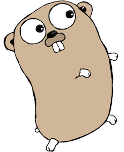

# What is Next for go-slalom?

- add ui and demonstrate go templating
- add metrics and monitoring
  - [New Relic for go](https://docs.newrelic.com/docs/agents/go-agent/get-started/introduction-new-relic-go)
- add http middleware (logging, tracing, etc)
- add micro service features 
- define a gRPC service
- use go-swagger to define an API 
- add helm charts
  - db (mongodb, postgres)
  - grafana
- setup ci/cd
  - gitlab
  - AWS code build and code pipeline
- add an ingress controller and define ingress

