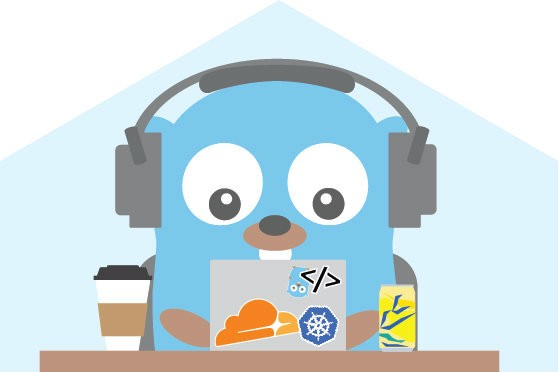

# Why Go

My favorite go proverbs from <https://go-proverbs.github.io>

> - A little copying is better than a little dependency.
> - Clear is better than clever.
> - Reflection is never clear.

## What is Go?

Go was developed by Google in 2007. It combines the ease of programming of an interpreted, dynamically typed language
with the efficiency and safety of a statically typed, compiled language.

It was designed to take advantage of multi-core, multi-processor machines making it ideal for developing fast services
that need to scale.

## Ok, But why do I care?

Based on my experience using Go I highly recommend you learn and use Go for new services that you create.

**Why?** I feel the simplicity and speed of Go allows me to more easily solve problems and not let the language get in my way. And everyone likes gophers!

## What is great about Go

- Simple but opinionated
- Statically typed (strong), modern and **fast** compiler
- Produces **fast**, runnable, static **binaries**. Easily generate binary for any platform without any dependencies
- Designed for **scalability** and **concurrency**
- Quickly and easily build CLI/APIs. You don’t need a web development framework! The standard library provides everything you need to build a web server, do routing, html templates, file serving, res/req handling, databases, etc..
- Strong standard library
- Strong standard tooling
- Strong open source community with abundance of packages
- Tests first class citizen
- While not a functional programming language, go has many functional programming features
  - functions as values (first class objects)
  - closures
  - function types
  - anonymous functions

## What Go doesn't have (intentionally)

- Inheritance and Classes. It uses structs, interfaces, and struct embedding to achieve powerful but simple OOP.
- Generics. Generics implementations add complexity and slow compilation or execution. Using interfaces and type aliases can suffice for generics. And after a while you won't miss `List<Dictionary<string<IEnumerable<HttpRequest>>>>`
  - however, generics have been proposed for go 2.0
- Annotations
- Exceptions

Some of the points above you may find shocking and think that go lacks "modern" language features... but trust me, the small amount of extra code you may write is worth the time you will save.

## Give Go a Chance

I will be frank and say when I first started using go I was not impressed. It seemed a bit archaic. I was fond of lambdas and streams in Java and the one-liners you can write would now take multiple lines and loops in go. I loved SpringBoot and magic it brings with annotations.

However, I think we tend to over engineer and over think our code. Go helps you focus on the problem and less on the code. I still like SpringBoot, but with plethora of tools available for go I do not miss it.

## Next

[go-101](go-101.md)

